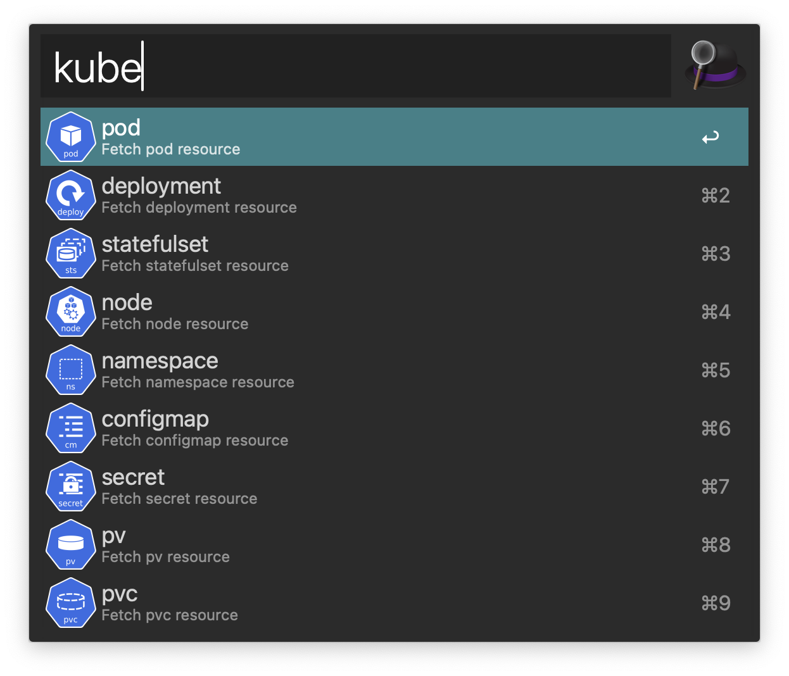
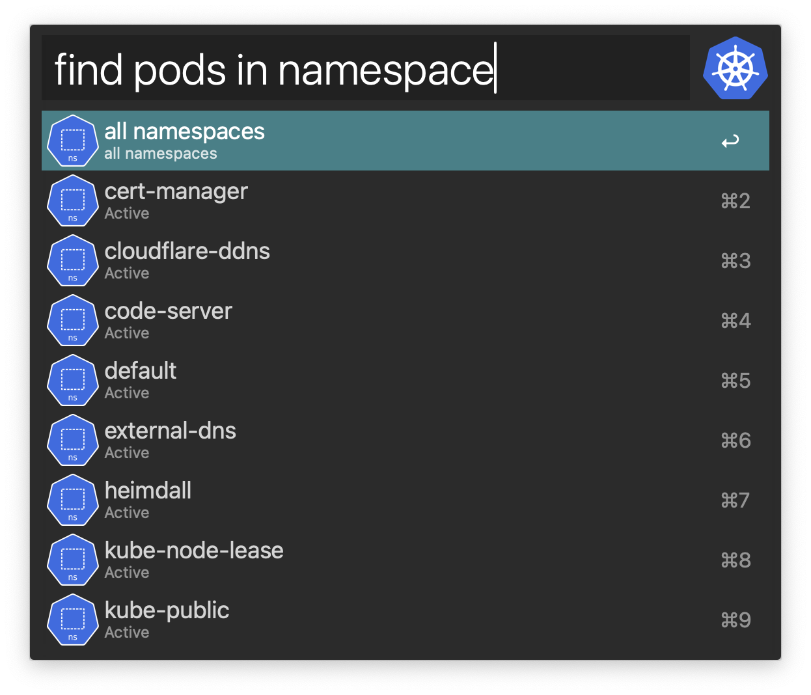
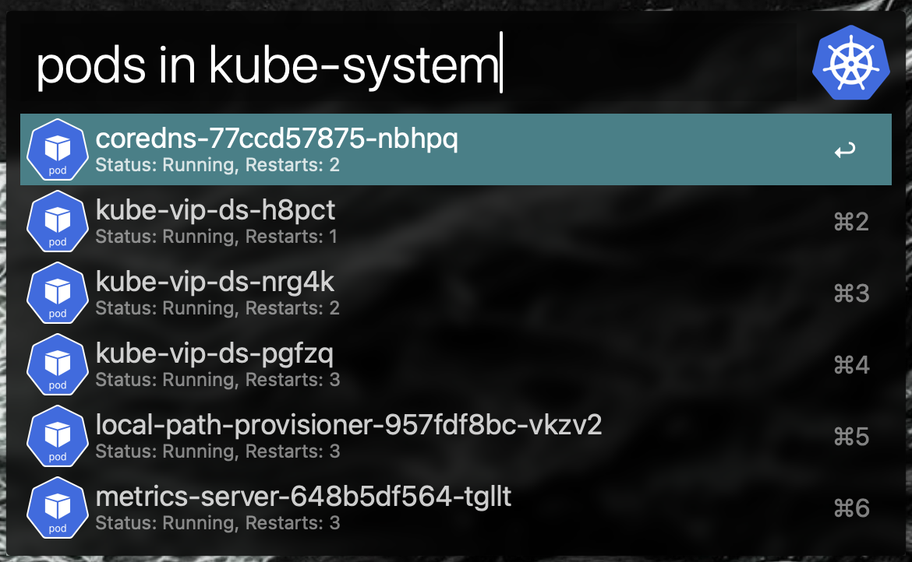

# Alfred-kubectl

Alfred workflow that can interact with a Kubernetes cluster.

## Table of contents
- [Installation](#installation)
- [Usage](#usage)
  - [Action Modifiers](#action-modifiers)
  - [Workflow Screenshots](#workflow-screenshots)
- [Dependencies](#dependencies)

## Installation
You can install this workflow by downloading the most recent release from [Github](https://github.com/chrede88/alfred-kubectl/releases) or get it through [Alfred Gallery](https://alfred.app/) (not possible yet).

You will be asked to set two variables when first installing the workflow:
1) The path to your kube configuration file.
2) The name of the default kubernetes context you want to use.

The default values will work out of the box for most people.

## Usage
The workflow has two keyword methods:
1) kube
2) kube-context

The latter makes it easy to switch context. This can also be done by pressing `Configure Workflow...` under this workflow in Alfred preferences.

The main keyword `kube` will fire a series of api calls which guides the user through retrieving the resources on the cluster.

The supported global resource types are:
- Node
- Namespace
- PV

The supported namespaced resource types are:
- Pod
- Deployment
- Configmap
- Secret
- Statefulset
- PVC

### Action Modifiers
More details about a resource can be displyed in a Terminal window by hitting <kbd>⌘</kbd><kbd>⏎</kbd> on a selected resource.

Pod resources have two further options:
1) <kbd>⌥</kbd><kbd>⏎</kbd> displays the logs in a Terminal window.
2) <kbd>⌃</kbd><kbd>⏎</kbd> opens an interactive session in a pod, using `/bin/sh`, in a Terminal window.

### Workflow screenshots

Inital promt - pick a resource type

Pick a namespace or choose all namespaces

Get resources

## Dependencies

This workflow relies on Python 3 and the following python packages (all shipped with the workflow):
- os
- sys
- json
- kubernetes

The workflow furthermore relies on the `Kubectl` CLI package for fetching details about the resources, pod logs and for executing code in pods (kubectl exec). Both resource details and pod logs will be moved away from kubectl in a later release, but opening interactive sessions into pods can't be done through the python client.

Kubectl can be [installed](https://kubernetes.io/docs/tasks/tools/install-kubectl-macos/) with Homebrew and from binaries.